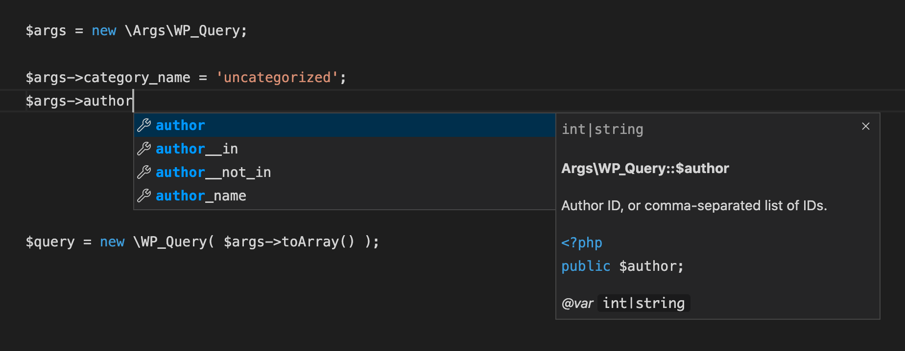

[](https://github.com/johnbillion/args/actions)

# Args

Many functions and methods in WordPress accept arguments as an associative array which your IDE or code editor cannot autocomplete like it does for individual function parameters.

```php
$query = new WP_Query( [
	'post_type' => 'post',
	'category' => 'does this accept an ID or a slug?',
	'number_of_...errr'
] );
```

This library provides well-documented classes which represent many of the associative array parameters used throughout WordPress. Using them at the point where you populate the arguments means you get autocompletion and intellisense in your code editor, and strict typing thanks to typed properties in PHP 7.4. Comprehensive types and constraints for [PHPStan](https://phpstan.org/) are also included.



## Current Status

Last updated for WordPress 6.4.

## Requirements

* PHP 7.4 or PHP 8+

## Installation

```shell
composer require johnbillion/args
```

## Usage

Usage with a class constructor:

```php
$args = new \Args\WP_Query;

$args->tag = 'amazing';
$args->posts_per_page = 100;

$query = new \WP_Query( $args->toArray() );
```

Usage with a procedural function parameter:

```php
$args = new \Args\register_post_type;

$args->show_in_rest = true;
$args->taxonomies = [ 'genre', 'audience' ];

$story = register_post_type( 'story', $args->toArray() );
```

## Meta Queries, Tax Queries, and Date Queries

The query classes in WordPress support variously `meta_query`, `tax_query`, and `date_query` arguments. These are fully supported and you can construct them in a structured and strongly typed way.

Creating a `meta_query` argument:

```php
$args = new \Args\WP_Query;

// Create a clause
$clause = new \Args\MetaQuery\Clause;
$clause->key = 'my_meta_key';
$clause->value = 'my_meta_value';

// Add the clause
$args->meta_query->clauses[] = $clause;

$query = new \WP_Query( $args->toArray() );
```

Creating a `tax_query` argument:

```php
$args = new \Args\WP_Query;

// Create a clause
$clause = new \Args\TaxQuery\Clause;
$clause->taxonomy = 'post_tag';
$clause->terms = [ 'amazing' ];

// Add the clause
$args->tax_query->clauses[] = $clause;

$query = new \WP_Query( $args->toArray() );
```

Creating a `date_query` argument:

```php
$args = new \Args\WP_Query;

// Create a clause
$clause = new \Args\DateQuery\Clause;
$clause->year = 2000;
$clause->compare = '>=';

// Add the clause
$args->date_query->clauses[] = $clause;

$query = new \WP_Query( $args->toArray() );
```

Alternatively you can construct a complete query object by calling the `fromArray()` static method with the same nested array syntax that WordPress core uses:

```php
$args = new \Args\WP_Query;

// Set the meta query from an array
$array = [
	[
		'key' => 'my_meta_key',
		'value' => 'my_meta_value',
	]
];
$args->meta_query = $args->meta_query::fromArray( $array );

$query = new \WP_Query( $args->toArray() );
```

## What's Provided

### Posts

* `\Args\WP_Query`
* `\Args\register_post_type`
* `\Args\wp_insert_post`
* `\Args\wp_update_post`
* `\Args\get_posts`
* `\Args\register_post_meta`
* `\Args\register_post_status`

### Taxonomies and Terms

* `\Args\WP_Term_Query`
* `\Args\register_taxonomy`
* `\Args\wp_insert_term`
* `\Args\wp_update_term`
* `\Args\get_terms`
* `\Args\get_categories`
* `\Args\get_tags`
* `\Args\register_term_meta`
* `\Args\wp_count_terms`
* `\Args\wp_get_object_terms`
* `\Args\wp_dropdown_categories`

### Users

* `\Args\WP_User_Query`
* `\Args\wp_insert_user`
* `\Args\wp_update_user`
* `\Args\get_users`

### Comments

* `\Args\WP_Comment_Query`
* `\Args\get_comments`

### HTTP API

* `\Args\wp_remote_get`
* `\Args\wp_remote_post`
* `\Args\wp_remote_head`
* `\Args\wp_remote_request`
* `\Args\wp_safe_remote_get`
* `\Args\wp_safe_remote_post`
* `\Args\wp_safe_remote_head`
* `\Args\wp_safe_remote_request`

### Blocks

* `\Args\WP_Block_Type`
* `\Args\register_block_type`

### Customizer

* `\Args\WP_Customize_Control`
* `\Args\WP_Customize_Manager`
* `\Args\WP_Customize_Panel`
* `\Args\WP_Customize_Section`
* `\Args\WP_Customize_Setting`

### Everything Else

* `\Args\paginate_links`
* `\Args\register_meta`
* `\Args\register_rest_field`
* `\Args\wp_get_nav_menus`
* `\Args\wp_nav_menu`
* `\Args\wp_die`
* `\Args\wp_dropdown_languages`
* `\Args\wp_generate_tag_cloud`

## Type Checking

Typed class properties are implemented in this library where possible. If you pass a value of the wrong type to an argument that is typed, you'll get a fatal error as long as you're using strict types:

```php
<?php
declare( strict_types=1 );
```

No more mysterious bugs due to incorrect types.

Note that several parameters in WordPress accept multiple types, for example the `$ignore_sticky_posts` argument for `\WP_Query` can be a boolean or an integer. In some of these cases I've opted to type the parameter with the most appropriate type even though it can technically accept other types.

## Static Analysis

PHPStan-specific `@phpstan-var` tags are used for properties that have a fixed set of values or other constraints. This allows for even greater type and value checking via static analysis with PHPStan.

Ensure you're using PHPStan 1.0 or higher to make the best use of these constraints.

## Contributing

Check out [CONTRIBUTING.md](CONTRIBUTING.md) for information about generating your own Args definitions or contributing to the Args library.

## But Why?

I have a name for these array-type parameters for passing arguments. I call them *Stockholm Parameters*. We've gotten so used to using them that we forget what a terrible design pattern it is. This library exists to work around the immediate issue without rearchitecting the whole of WordPress.

## Sponsors

The time that I spend maintaining this library and others is in part sponsored by:

[](https://automattic.com)

Plus all my kind sponsors on GitHub:

[](https://github.com/sponsors/johnbillion)

[Click here to find out about supporting this library and my other WordPress development tools and plugins](https://github.com/sponsors/johnbillion).

## License: GPLv2

This program is free software; you can redistribute it and/or modify
it under the terms of the GNU General Public License as published by
the Free Software Foundation; either version 2 of the License, or
(at your option) any later version.

This program is distributed in the hope that it will be useful,
but WITHOUT ANY WARRANTY; without even the implied warranty of
MERCHANTABILITY or FITNESS FOR A PARTICULAR PURPOSE.  See the
GNU General Public License for more details.
