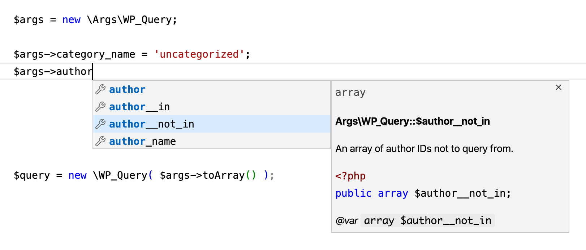

# Args

Many functions and methods in WordPress accept arguments as an associative array. Your IDE or text editor cannot provide autocompletion and type hinting for each element in the array like it does for individual function parameters.

```php
$query = new WP_Query( [
	'post_type' => 'post',
	'category_something' => 'does this accept an integer or a string?',
	'number_of_...errr'
] );
```

This library provides well-documented classes which represent some of the associative array parameters that are used in WordPress. Using these classes at the point where you populate the arguments means you get familiar autocompletion and intellisense in your code editor, and strict typing thanks to the behaviour of typed properties in PHP 7.4. PHPstan typings are provided for even more comprehensive checks, if you use it.



This library does _not_ operate like [the `OptionsResolver` class in Symfony](https://symfony.com/doc/current/components/options_resolver.html) because I don't know of any array parameters in WordPress that have required elements.

---

* [Current Status](#current-status)
* [Usage](#usage)
* [What's Provided](#whats-provided)
* [Type Checking](#type-checking)
* [Requirements](#requirements)
* [Installation](#installation)
* [But Why?](#but-why)

---

## Current Status

Proof of concept

## Usage

```php
$args = new \Args\WP_Query;

$args->tag = 'amazing';
$args->posts_per_page = 100;

$query = new \WP_Query( $args->toArray() );
```

```php
$args = new \Args\get_posts;

$args->numberposts = 25;
$args->suppress_filters = false;

$posts = get_posts( $args->toArray() );
```

## What's Provided

* `\Args\WP_Query` for the `WP_Query` class constructor
* `\Args\get_posts` for the `get_posts()` function

These classes are generated directly from the parameter hash notation in WordPress core. I'll be working on a partly automated process for creating these at some point. I need to give some more thought on how best to name these classes and how best to handle functions that accept multiple parameters where one or more is an args array.

## Type Checking

PHP 7.4 introduced typed class properties, and these are implemented in this library where possible. If you pass a value of the wrong type to an argument that is typed, you'll get a fatal error. No more mystery bugs.

Note that several parameters in WordPress accept multiple types, for example the `$ignore_sticky_posts` for `\WP_Query` can be a boolean or an integer. Other parameters accept either a numerical string or an integer. In some of these cases I've opted to type the parameter with the most appropriate type even though it can technically accept other types.

## Static Analysis

Some PHPStan-specific `@phpstan-var` tags are used for properties that have a fixed set of values. This effectively turns the properties into enums and allows for even greater type and value checking via static analysis with PHPStan.

## Requirements

* PHP 7.4+

## Installation

```
composer require johnbillion/args
```

## But Why?

I have a name for these array-type parameters for passing arguments. I call them *Stockholm Parameters*. We've gotten so used to using them that we forget what a terrible design pattern it is. This library exists to work around the immediate issue without rearchitecting the whole of WordPress.
